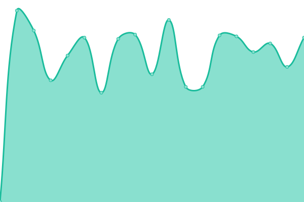
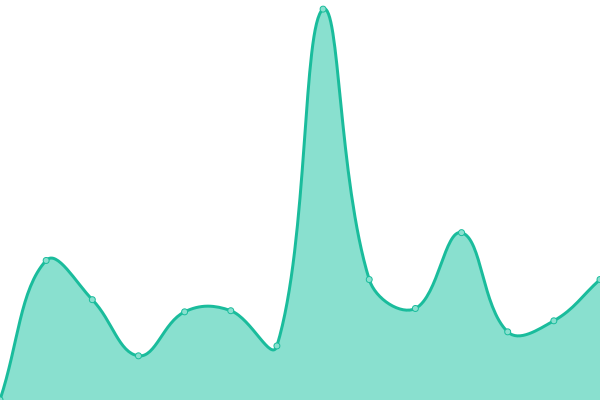
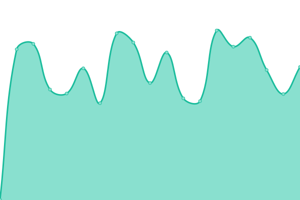

# [📈 Live Status](https://alpacax.github.io/alpacon-status-dev): <!--live status--> **🟩 All systems operational**

This repository contains the open-source uptime monitor and status page for [AlpacaX](https://www.alpacax.com), powered by [Upptime](https://github.com/upptime/upptime).

With [Upptime](https://upptime.js.org), you can get your own unlimited and free uptime monitor and status page, powered entirely by a GitHub repository. We use [Issues](https://github.com/alpacax/alpacon-status-dev/issues) as incident reports, [Actions](https://github.com/alpacax/alpacon-status-dev/actions) as uptime monitors, and [Pages](https://alpacax.github.io/alpacon-status-dev) for the status page.

<!--start: status pages-->
<!-- This summary is generated by Upptime (https://github.com/upptime/upptime) -->
<!-- Do not edit this manually, your changes will be overwritten -->
<!-- prettier-ignore -->
| URL | Status | History | Response Time | Uptime |
| --- | ------ | ------- | ------------- | ------ |
|  [AlpacaX Web](https://staging.alpacax.com/) | 🟩 Up | [alpaca-x-web.yml](https://github.com/alpacax/alpacon-status-dev/commits/HEAD/history/alpaca-x-web.yml) | 

 594ms
     
 | 

<a href="https://alpacax.github.io/alpacon-status-dev/history/alpaca-x-web">78.87%</a>
    

|  [Alpacon Docs](https://docs.staging.alpacax.com/) | 🟩 Up | [alpacon-docs.yml](https://github.com/alpacax/alpacon-status-dev/commits/HEAD/history/alpacon-docs.yml) | 

 687ms
     
 | 

<a href="https://alpacax.github.io/alpacon-status-dev/history/alpacon-docs">78.84%</a>
    

|  [Alpacon Dev](https://dev.alpacon.io/alpacax) | 🟩 Up | [alpacon-dev.yml](https://github.com/alpacax/alpacon-status-dev/commits/HEAD/history/alpacon-dev.yml) | 

 725ms
     
 | 

<a href="https://alpacax.github.io/alpacon-status-dev/history/alpacon-dev">100.00%</a>
    

|  [Alpacon Dev API](https://dev.alpacon.io/api/) | 🟩 Up | [alpacon-dev-api.yml](https://github.com/alpacax/alpacon-status-dev/commits/HEAD/history/alpacon-dev-api.yml) | 

 105ms
     
 | 

<a href="https://alpacax.github.io/alpacon-status-dev/history/alpacon-dev-api">100.00%</a>
    

|  [Account Service](https://account.staging.alpacax.com) | 🟩 Up | [account-service.yml](https://github.com/alpacax/alpacon-status-dev/commits/HEAD/history/account-service.yml) | 

 799ms
     
 | 

<a href="https://alpacax.github.io/alpacon-status-dev/history/account-service">100.00%</a>
    

|  [Payment Web](https://pay.staging.alpacax.com/) | 🟩 Up | [payment-web.yml](https://github.com/alpacax/alpacon-status-dev/commits/HEAD/history/payment-web.yml) | 

 799ms
     
 | 

<a href="https://alpacax.github.io/alpacon-status-dev/history/payment-web">100.00%</a>
    

|  [Payment API](https://pay.staging.alpacax.com/api/) | 🟩 Up | [payment-api.yml](https://github.com/alpacax/alpacon-status-dev/commits/HEAD/history/payment-api.yml) | 

 171ms
     
 | 

<a href="https://alpacax.github.io/alpacon-status-dev/history/payment-api">100.00%</a>
    

<!--end: status pages-->

[**Visit our status website →**](https://alpacax.github.io/alpacon-status-dev)

## 📄 License

- Powered by: [Upptime](https://github.com/upptime/upptime)
- Code: [MIT](./LICENSE) © [Anand Chowdhary](https://anandchowdhary.com), supported by [Pabio](https://pabio.com)
- Data in the `./history` directory: [Open Database License](https://opendatacommons.org/licenses/odbl/1-0/)
