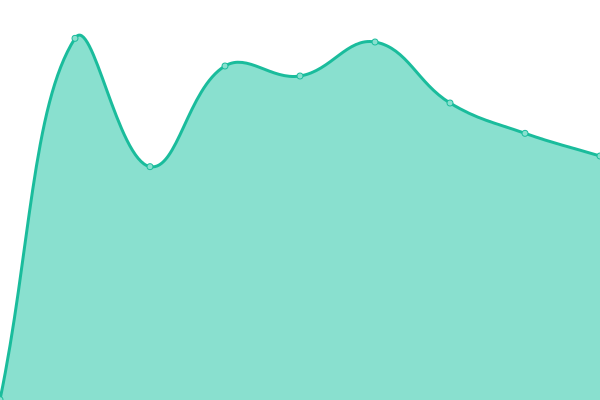

# [📈 Live Status](https://alpacax.github.io/alpacon-status-dev): <!--live status--> **🟩 All systems operational**

This repository contains the open-source uptime monitor and status page for [AlpacaX](https://www.alpacax.com), powered by [Upptime](https://github.com/upptime/upptime).

With [Upptime](https://upptime.js.org), you can get your own unlimited and free uptime monitor and status page, powered entirely by a GitHub repository. We use [Issues](https://github.com/alpacax/alpacon-status-dev/issues) as incident reports, [Actions](https://github.com/alpacax/alpacon-status-dev/actions) as uptime monitors, and [Pages](https://alpacax.github.io/alpacon-status-dev) for the status page.

<!--start: status pages-->
<!-- This summary is generated by Upptime (https://github.com/upptime/upptime) -->
<!-- Do not edit this manually, your changes will be overwritten -->
<!-- prettier-ignore -->
| URL | Status | History | Response Time | Uptime |
| --- | ------ | ------- | ------------- | ------ |
|  [Alpacon](https://dev.alpacon.io/) | 🟩 Up | [alpacon.yml](https://github.com/alpacax/alpacon-status-dev/commits/HEAD/history/alpacon.yml) | 

 809ms
     
 | 

<a href="https://status.staging.alpacax.com/history/alpacon">100.00%</a>
    

|  [Alpacon API](https://dev.alpacon.io/api/) | 🟩 Up | [alpacon-api.yml](https://github.com/alpacax/alpacon-status-dev/commits/HEAD/history/alpacon-api.yml) | 

 312ms
     
 | 

<a href="https://status.staging.alpacax.com/history/alpacon-api">100.00%</a>
    

|  [Alpacon AI](https://alpacon.ai/health/deep) | 🟩 Up | [alpacon-ai.yml](https://github.com/alpacax/alpacon-status-dev/commits/HEAD/history/alpacon-ai.yml) | 

 929ms
     
 | 

<a href="https://status.staging.alpacax.com/history/alpacon-ai">98.31%</a>
    

|  [Alpacon Docs](https://docs.staging.alpacax.com/) | 🟩 Up | [alpacon-docs.yml](https://github.com/alpacax/alpacon-status-dev/commits/HEAD/history/alpacon-docs.yml) | 

 668ms
     
 | 

<a href="https://status.staging.alpacax.com/history/alpacon-docs">100.00%</a>
    

|  [Account](https://account.staging.alpacax.com) | 🟩 Up | [account.yml](https://github.com/alpacax/alpacon-status-dev/commits/HEAD/history/account.yml) | 

 1150ms
     
 | 

<a href="https://status.staging.alpacax.com/history/account">100.00%</a>
    

|  [Payment](https://pay.staging.alpacax.com/) | 🟩 Up | [payment.yml](https://github.com/alpacax/alpacon-status-dev/commits/HEAD/history/payment.yml) | 

 936ms
     
 | 

<a href="https://status.staging.alpacax.com/history/payment">100.00%</a>
    

|  [Payment API](https://pay.staging.alpacax.com/api/) | 🟩 Up | [payment-api.yml](https://github.com/alpacax/alpacon-status-dev/commits/HEAD/history/payment-api.yml) | 

 527ms
     
 | 

<a href="https://status.staging.alpacax.com/history/payment-api">100.00%</a>
    

|  [AlpacaX](https://staging.alpacax.com/) | 🟩 Up | [alpaca-x.yml](https://github.com/alpacax/alpacon-status-dev/commits/HEAD/history/alpaca-x.yml) | 

 523ms
     
 | 

<a href="https://status.staging.alpacax.com/history/alpaca-x">100.00%</a>
    

<!--end: status pages-->

[**Visit our status website →**](https://alpacax.github.io/alpacon-status-dev)

## 📄 License

- Powered by: [Upptime](https://github.com/upptime/upptime)
- Code: [MIT](./LICENSE) © [Anand Chowdhary](https://anandchowdhary.com), supported by [Pabio](https://pabio.com)
- Data in the `./history` directory: [Open Database License](https://opendatacommons.org/licenses/odbl/1-0/)
